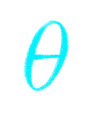

### Implementierungsaspekte

#### Farben

Diese
* wie bekommen wir daraus Farben?
-> das ist erstmal nur intensität, die kann in farbberechnung eingebaut werden
-> einfacher phong shader
-> auf artefakte bei 90° hinweisen
->
* half vector -> gegenüberstellung

* implementierungsaspekte
-> pro objekt, primitiv, vertex, fragment
* invertiertes L -> was anderes? S?

    <svg class="zdog-canvas-half-vector" id="zdog-canvas-half-vector" width="760" height="340">
    

    

    
<b>N</b>

    
<b>L</b>

    
<b>R</b>

    
<b>V</b>

    
 = 
123
°

</svg>

    <svg class="zdog-canvas-half-vector2" id="zdog-canvas-half-vector2" width="760" height="340">
    

    

    
<b>N</b>

    
<b>L</b>

    <!--
<b>R</b>
-->
    
<b>V</b>

    
<b>H</b>

    
 = 
123
°

</svg>

<!--<iframe src="https://codesandbox.io/embed/amazing-sun-27mwhg?fontsize=14&hidenavigation=1&theme=dark"
     style="width:100%; height:700px; border:0; border-radius: 4px; overflow:hidden;"
     title="amazing-sun-27mwhg"
     allow="accelerometer; ambient-light-sensor; camera; encrypted-media; geolocation; gyroscope; hid; microphone; midi; payment; usb; vr; xr-spatial-tracking"
     sandbox="allow-forms allow-modals allow-popups allow-presentation allow-same-origin allow-scripts"
     scrolling = "no"
   ></iframe>-->
